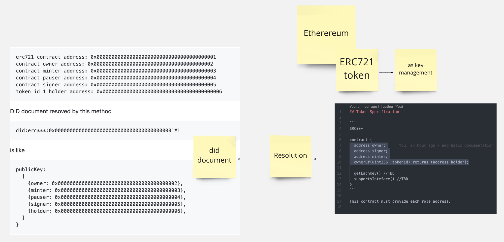
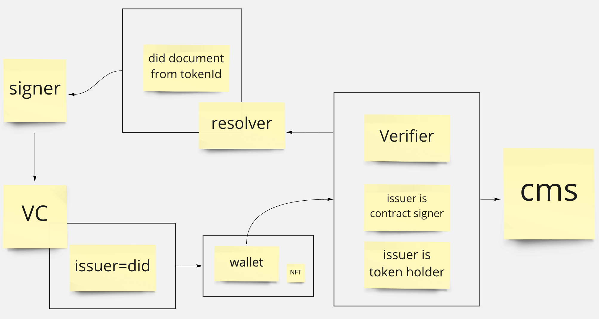

## Tokenized Did Resolution



This is poc repository for Tokenized Did Resolution. This repo will be consisted of 3 core modules.

- Token Specification
- Did Resolver
- VC Verifier

## Motivation

This is to use ERC721 Token as a way of did document resolution, so that service can have

- effective rights management of contents
- decentralizing token transaction betwreen user

## Basic Concept

This protocol use ERC721 token (aften called as NFT token) for did resolution.

For example when token has following state,

```
erc721 contract address: 0x0000000000000000000000000000000000000001
contract owner address: 0x0000000000000000000000000000000000000002
contract minter address: 0x0000000000000000000000000000000000000003
contract pauser address: 0x0000000000000000000000000000000000000004
contract signer address: 0x0000000000000000000000000000000000000005
token id 1 holder address: 0x0000000000000000000000000000000000000006
```

DID document resoved by this method

```
did:erc***:0x0000000000000000000000000000000000000001#1
```

is like

```
publicKey:
  [
    {owner: 0x0000000000000000000000000000000000000002},
    {minter: 0x0000000000000000000000000000000000000003},
    {pauser: 0x0000000000000000000000000000000000000004},
    {signer: 0x0000000000000000000000000000000000000005},
    {holder: 0x0000000000000000000000000000000000000006},
  ]
}
```

This did methods is consisted of contract address and token Id, then did document is resolved for each role of contract.

## Why this procol is required?

We currently working on ethereum erc721 based content management sysytem [bazaaar.io](https://github.com/block-base/bazaaar.io/)



In our use case, we want to let many kinds of organization can able to publish token, and integrate the tokenized rights management system to thier distribution service as add-on.

Our add-on wants to provide not only "who can access the contents", but also "who can contribute the contents distribution".

So for example our case,

### Case1

```
alice can access contents using token holder rights.
alice can distribute contents to bob using token holder rights.
```

### Case2

```
contract is deployed, but alice still not have published token in her wallet.
contract signer can sign for alice to access contents.
```

In this way, using this protocol, it is easy to implement signature verification and have more complecated rights management of contents.
